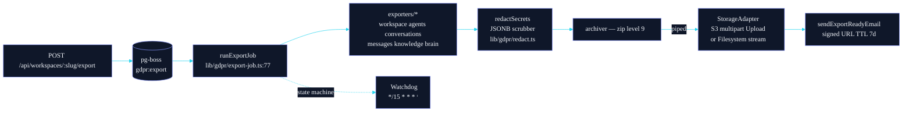

# Architecture

This document is the map of the codebase. It explains what lives where, how a request flows through the system, where the security boundaries are, and which decisions are load-bearing.

Audience: new contributors and anyone evaluating Orchester for a non-trivial deployment. Out of scope: tutorials and "how to use Orchester" — see the [README quickstart](../README.md#quickstart) for that.

## Top-level shape

```
orchester/
├── apps/
│   ├── web/         Next.js 15 application (Studio UI + REST API + MCP + worker)
│   └── widget/      Embeddable chat widget (separate bundle)
├── packages/
│   └── db/          Drizzle schema, migrations, typed client
├── scripts/
│   └── audit-invariants.sh   Structural CI guard
└── docs/            Public docs: this file, ADRs, runbook, audit playbook

../mnemosyne/        Sibling standalone repo — multi-tenant memory service
                     (extraction, recall, consolidation, Memory Graph).
                     Vendored as a git submodule at vendor/mnemosyne; the
                     typed SDK `@mnemosyne/client-ts` is the only thing
                     orchester imports at runtime.
```

One Next.js app. One typed-DB package. One widget. The **memory engine —
[Mnemosyne](https://github.com/lucasmailland/mnemosyne)** — runs as an
**independent HTTP service** with its own Postgres + pgvector and is consumed
from `apps/web` exclusively through the **`@mnemosyne/client-ts` SDK** (one
URL, one API key). The submodule under `vendor/mnemosyne/` exists so the SDK
package resolves via `file:` link without a separate npm publish; orchester
itself never imports `@mnemosyne/core` directly. The worker process is the
same code bundle started in a different mode (`pnpm worker:dev` / `pnpm
worker`); schema, types, and helpers are shared at compile time — there is no
RPC boundary between the API and worker code.

## Runtime topology

```
                        ┌──────────────────────────────┐
                        │   Next.js 15 (App Router)    │
                        │                              │
   Browser  ────────►   │   • Studio (React + HeroUI)  │
                        │   • REST API + SSE           │
                        │   • MCP server (HTTP+stdio)  │
   MCP client ──────►   │   • Public /api/v1/*         │
                        └──────────────────────────────┘
                              │                  │
                              ▼                  ▼
        ┌────────────────────────────┐   ┌──────────────────────────┐
        │  Postgres 15+ (host)       │   │  Mnemosyne service       │
        │  • Application data        │   │  • @mnemosyne/server     │
        │  • Job queue (pg-boss)     │   │  • Hono /v1/* REST        │
        │  • KB embeddings           │   │  • API-key auth (bcrypt) │
        │  • RLS+FORCE Pattern A     │   │  • Maintenance crons     │
        │  • Advisory locks          │   │                          │
        └────────────────────────────┘   └────────────┬─────────────┘
                              ▲                       ▼
                              │             ┌─────────────────────────┐
                              │             │  Postgres + pgvector    │
            ┌──────────────────────────┐    │  (mnemosyne-postgres)   │
            │   Worker process         │    │  • mnemo_fact / entity  │
            │   (same image, worker    │    │  • mnemo_episode / etc. │
            │    mode)                 │    │  • halfvec(1536)        │
            │   • Flows + reaper       │    └─────────────────────────┘
            │   • GDPR export pipeline │
            │   • Audit chain verify   │
            └──────────────────────────┘
                              │
                              ▼
                       ┌────────────────────────────────┐
                       │   AI providers (BYO keys)      │
                       │   80+ adapters, 10 capabilities│
                       └────────────────────────────────┘
```

Two Postgres databases, two independent services. The **orchester** DB owns
application state (users, workspaces, flows, conversations, agents, the KB).
The **mnemosyne-postgres** DB owns memory state (facts, entities, episodes,
relations, decisions). The host never reads or writes the mnemo schema
directly — every memory op round-trips through `@mnemosyne/client-ts` to
`@mnemosyne/server` (default port `3939`), which scopes the request to the
caller's API-key workspace and runs every query under `withMnemoTx`. See the
[Mnemosyne section](#mnemosyne-memory-service) below for the cut.

The worker is the _same_ process bundle as the web app started in a different
mode. Schema, types, and helpers are shared at compile time — there is no
RPC boundary between the API and worker code. Mnemosyne crons (dedup, prune,
consolidate, summary, decay, health, auto-pin, review-sweep) run **inside
the mnemosyne service**, not in this worker — Phase 3 (2026-06-05) cut them
over so the host worker only schedules flow + GDPR + audit-chain jobs.

## Request lifecycle

A representative POST `/api/flows/:id/run` request. The diagram is end-to-end; the steps below annotate each hop with its module.

```mermaid
%%{init: {
  "theme": "base",
  "themeVariables": {
    "primaryColor": "#0f1729",
    "primaryTextColor": "#f4f7fc",
    "primaryBorderColor": "#8a98ff",
    "lineColor": "#22d3ee",
    "secondaryColor": "#1c2440",
    "tertiaryColor": "#0a1020",
    "noteBkgColor": "#0b1322",
    "noteTextColor": "#a4b1cb",
    "noteBorderColor": "#2a3a5e",
    "edgeLabelBackground": "#0f1729",
    "clusterBkg": "#0b1322",
    "clusterBorder": "#2a3a5e",
    "fontFamily": "ui-sans-serif, -apple-system, Segoe UI, Inter, sans-serif"
  }
}}%%
flowchart LR
  Client[Browser / API client]
  Edge[Edge middleware<br/>apps/web/middleware.ts]
  Route[Route handler<br/>apps/web/app/api/...]
  Ctx[withTenantContext<br/>lib/tenant/context.ts:49]
  Gate[Quota + spend gate<br/>lib/billing/quotas.ts<br/>lib/cost-alerts.ts]
  Queue[(pg-boss<br/>flow:run)]
  Worker[Worker<br/>lib/flow-engine.ts:362]
  DB[(Postgres<br/>RLS+FORCE)]

  Client -->|HTTPS| Edge
  Edge -->|locale + auth + rate-limit| Route
  Route -->|zod + assertCan| Ctx
  Ctx -->|SET LOCAL ROLE app_user<br/>app.workspace_id GUC| Gate
  Gate -->|advisory xact lock| DB
  Gate --> Queue
  Queue --> Worker
  Worker -->|withFlowTx per phase| DB
  Worker -->|SSE telemetry| Client
```



1. **Edge middleware** (`apps/web/middleware.ts`) — locale routing, auth cookie check, rate limiting (Redis-backed if configured, otherwise an in-memory limiter; both gated by `lib/rate-limit.ts`).
2. **Route handler** (`apps/web/app/api/...`) — zod validates the body, `auth-guards.ts` resolves the session into a `{ userId, workspaceId, role }` triple.
3. **RBAC check** — `lib/rbac.ts` exposes `assertCan(role, action)`. Every mutating route calls it. The structural invariants guard fails the build if a new mutating route forgets either zod or `assertCan`.
4. **Tenant context** — `withTenantContext(workspaceId, fn)` (`lib/tenant/context.ts:49`) opens a Postgres transaction, runs `SET LOCAL ROLE app_user` (drops `BYPASSRLS`), then `SET LOCAL app.workspace_id` + `app.user_id`. Every query inside the callback is subject to RLS+FORCE Pattern A — the WHERE clause is no longer the only thing keeping tenants apart.
5. **Quota + spend gates** — `lib/billing/quotas.ts` (plan limits) and the spend cap check in `lib/cost-alerts.ts` (`assertWithinSpend`) run inside the same DB transaction as the write that consumes them, protected by a `pg_advisory_xact_lock` keyed on `workspaceId`. This closes the TOCTOU window that an earlier audit pass found.
6. **Job enqueue** — for flow runs, the request enqueues a `flow:run` job in pg-boss and returns `202 Accepted` with the `runId`. SSE subscribers stream telemetry as the worker executes.
7. **Worker execution** — `lib/flow-engine.ts:362 executeFlow` walks the flow graph, dispatches to per-node executors (AI calls, HTTP, code-node sandbox, integration adapters, subflows), threads an `AbortSignal` so disconnected clients cancel cleanly, and writes telemetry events as it goes. Each phase opens its own short `withFlowTx` (also `SET LOCAL ROLE app_user` + GUC) so long-running flows don't hold a pool connection.

Read-only requests (list, get) skip steps 5–7 and return inline.

## Data model

`packages/db/src/schema/` is partitioned by domain:

| File              | Owns                                                         |
| ----------------- | ------------------------------------------------------------ |
| `core.ts`         | Users, workspaces, memberships, roles, sessions              |
| `auth.ts`         | Better-Auth tables (accounts, verifications, etc.)           |
| `workspaces.ts`   | Workspace settings, plans, quotas, audit log                 |
| `ai-providers.ts` | Provider credentials (encrypted), per-workspace model gating |
| `flows.ts`        | Flows, flow versions, flow runs, run telemetry               |
| `agent-tools.ts`  | Agent definitions, tool configs, agent memory policy         |
| `integrations.ts` | Integration accounts and credentials                         |
| `knowledge.ts`    | KB sources, chunks, embeddings (pgvector columns)            |
| `production.ts`   | Webhooks, channels, public API keys                          |
| `gdpr.ts`         | `gdpr_export_jobs` (state machine, signed-URL cache)         |

Memory state — `mnemo_fact`, `mnemo_decision`, `mnemo_episode`, `mnemo_entity`,
`mnemo_relation`, `mnemo_query_cache`, `mnemo_summary`, `mnemo_review_queue`,
`mnemo_fact_archive` — used to live alongside the application tables. **Phase 3
(2026-06-05) extracted them into the Mnemosyne service's own database**, so
the host schema no longer carries any `brain_*` or `mnemo_*` tables. The
remaining `lib/memory/graph-canvas/` module is a pure rendering helper (canvas
drawing primitives) that has no DB coupling.

Migrations live in `packages/db/migrations/` and are produced by `drizzle-kit
generate` (with hand-rolled `*.sql` files for RLS / policy / role setup).
Never run `drizzle-kit push` against anything but a throwaway dev DB — the
audit playbook documents why. The headline series:

- `0007_postgres_roles` — `app_user` role with `NOINHERIT LOGIN` and no
  `BYPASSRLS`. Cornerstone of Pattern A defense-in-depth (see Tenancy below).
- `0016`–`0052` — the brain/mnemosyne lifecycle, retained as immutable
  history. The schemas they create are dropped at the end by
  `0053_drop_legacy_brain_residue`, so a fresh `pnpm db:migrate` arrives at
  exactly the production shape with no orphaned tables.
- `0053_drop_legacy_brain_residue` — final cleanup of the Phase 3 cut-over.
  Idempotent (`DROP IF EXISTS`) so it's safe to replay on any environment.

### Tenancy

Every domain row has a `workspace_id`. The application-layer pattern is unchanged:

```ts
db.query.flows.findMany({ where: eq(flows.workspaceId, workspaceId) });
```

The structural-invariants guard still enforces that every workspace-scoped query carries the `workspaceId` predicate. **But** as of migrations 0008–0013 and the 2026-05-24 audit P0 fix, every tenant-scoped table now also has RLS+FORCE Pattern A policies that consult `current_setting('app.workspace_id')`. The two layers compose:

- Application filter — first line, catches dev mistakes at code-review time.
- RLS+FORCE — defence in depth, catches anything the filter missed at the DB layer.

The audit found that the deployed `DATABASE_URL` connects as a role with `rolbypassrls=t`, which silently disables RLS. The fix in `lib/tenant/context.ts` is to `SET LOCAL ROLE app_user` at the top of every tx — `app_user` is `NOINHERIT` with no `BYPASSRLS`, so RLS+FORCE actually applies regardless of how the connection was authenticated. The transaction-local scope means the role auto-reverts on commit/rollback and never leaks across pooled connections. See ADR-0010 for the layered remediation. Mnemosyne enforces the same Pattern A in its own DB (`withMnemoTx` inside the service); neither side of the cut-over has a weak link.

Two transaction wrappers on the host side, both built on the same pattern:

| Wrapper             | Authn check               | GUCs set                          | Use case                           |
| ------------------- | ------------------------- | --------------------------------- | ---------------------------------- |
| `withTenantContext` | session + membership      | `app.workspace_id`, `app.user_id` | User-facing API routes             |
| `withWorkspaceTx`   | none (caller responsible) | `app.workspace_id`                | Webhooks, MCP, worker, flow engine |

Memory reads/writes used to add a third wrapper, `withMnemoTx`, that ran
host-side against the local `mnemo_*` tables. Phase 3 retired it: memory ops
now go over HTTPS to `@mnemosyne/server`, which runs `withMnemoTx` on its own
DB. The host's API key authenticates the request _and_ pins it to a workspace,
so the request is workspace-scoped at the service boundary — cross-tenant
access is impossible regardless of how the host forms the request.

## Mnemosyne (memory service)

Mnemosyne is a **standalone HTTP service** with its own Postgres + pgvector and
its own bitemporal schema. Orchester is one of its clients. The cut over from
in-process library to HTTP service landed on 2026-06-05 (Phase 3) — every
memory operation in `apps/web` now flows through the `@mnemosyne/client-ts`
SDK, and the host DB carries zero memory tables.

For the canonical Mnemosyne spec (cognitive model, primitives, recall
pipeline, package layout, deployment), see the
[**Mnemosyne architecture doc**](https://github.com/lucasmailland/mnemosyne/blob/main/docs/architecture.md).
The rest of this section is the **integration surface**: how orchester talks
to Mnemosyne, where the SDK boundary falls, and what stays host-domain.

### Integration surface

| Concern                                             | Owner     | Where it lives                                                                                           |
| --------------------------------------------------- | --------- | -------------------------------------------------------------------------------------------------------- |
| `recall()` for every chat turn                      | Mnemosyne | `client.recall()` in `apps/web/lib/agent-runtime.ts`                                                     |
| Inspector UI (facts / timeline / graph / decisions) | Mnemosyne | SDK calls per route under `apps/web/app/api/mnemo/*`                                                     |
| Memory Graph rendering                              | Host      | `apps/web/components/brain/graph/*` + `lib/memory/graph-canvas/*` (pure canvas helpers, zero DB)         |
| Agent memory policy                                 | Host      | `apps/web/lib/policy/agent-memory.ts` — workspace-scoped agent config; not memory data                   |
| Decision BOM (audit + facts)                        | Hybrid    | `apps/web/app/api/mnemo/decisions/[traceId]/route.ts` — joins host `audit_log` with `client.listFacts()` |
| Fact extraction pipeline                            | Mnemosyne | The service ingests turns server-side via its own scheduler                                              |
| Maintenance crons (dedup, prune, etc.)              | Mnemosyne | All retired from `apps/web/worker/`; run inside the service                                              |
| Workspace API-key for the SDK                       | Host      | `MNEMO_URL` + `MNEMO_API_KEY` env, surfaced via `getMnemoClient()`                                       |

### Configuration

`apps/web/lib/mnemo/client.ts` exposes a memoized SDK client. The boundary is
two env vars:

```bash
MNEMO_URL=http://mnemosyne-server:3939
MNEMO_API_KEY=mns_live_…
```

The key is workspace-scoped on the Mnemosyne side; rotating it means a new
key on the service + a redeploy on the host. Production runs the Mnemosyne
service from the bundled Docker stack (`vendor/mnemosyne/docker/compose.yaml`)
or any host that accepts a long-running Node process.

### Recall on the chat turn

`apps/web/lib/agent-runtime.ts` is the only entry point that runs an agent
for a chat turn. The system prompt it builds is the concatenation of a
**cached prefix** (identity + Memory Protocol + distilled user-profile
summary) and a **dynamic suffix** (the live recall block). The Anthropic
prompt-cache boundary is set at the exact character offset where the cached
prefix ends, so the static portion is billed at ~10% on cache hits.

```mermaid
%%{init: {
  "theme": "base",
  "themeVariables": {
    "primaryColor": "#0f1729",
    "primaryTextColor": "#f4f7fc",
    "primaryBorderColor": "#8a98ff",
    "lineColor": "#22d3ee",
    "secondaryColor": "#1c2440",
    "tertiaryColor": "#0a1020",
    "noteBkgColor": "#0b1322",
    "noteTextColor": "#a4b1cb",
    "noteBorderColor": "#2a3a5e",
    "edgeLabelBackground": "#0f1729",
    "clusterBkg": "#0b1322",
    "clusterBorder": "#2a3a5e",
    "fontFamily": "ui-sans-serif, -apple-system, Segoe UI, Inter, sans-serif"
  }
}}%%
flowchart LR
  Turn[Conversational turn<br/>agent-runtime.ts]
  Profile[buildProfileBlock]
  Trigger[shouldTriggerRecall<br/>pure heuristic]
  SDK[client.recall&#40;&#41;<br/>@mnemosyne/client-ts]
  Render[renderFactsCompact<br/>+ wrapUntrusted]
  Prompt[System prompt =<br/>identity ‖ protocol ‖ profile ‖ recall]
  LLM[llmCall + tool loop]

  Turn --> Profile
  Profile --> Prompt
  Turn --> Trigger
  Trigger -->|skip on ack/greeting| Prompt
  Trigger -->|references past context| SDK
  SDK --> Render
  Render --> Prompt
  Prompt --> LLM
```

1. **`shouldTriggerRecall`** (pure heuristic, no IO) — skips on greetings /
   acks. Saves ~50% of recall calls on noisy workspaces.
2. **`buildProfileBlock`** distills a short user-profile snippet from the
   Mnemosyne summary endpoint when available, otherwise empty string.
3. **`client.recall()`** runs the full hybrid pipeline server-side (BM25 +
   dense vectors + graph expansion + cross-encoder rerank — see the
   [Mnemosyne spec](https://github.com/lucasmailland/mnemosyne/blob/main/docs/architecture.md#6-the-hybrid-recall-pipeline)).
   Hits return as ranked `RecallHit`s. Memory and KB are blended on the
   service side; the host adapter splits them again so they render as
   `<recalled-memory>` (facts) vs `<kb source="…">` blocks respectively.
4. **Render** wraps both inside `<untrusted_context>` and the system prompt
   carries `UNTRUSTED_CONTENT_GUARDRAIL` so prompt-injection payloads
   embedded in retrieved data are treated as data, not instructions.

Every layer is wrapped in `try / catch` — a slow or unreachable Mnemosyne
service degrades the turn to memory-less behaviour, never breaks it.

### Inspector + Memory Graph

The Brain Inspector is a UI shell over the SDK. Every route under
`apps/web/app/api/mnemo/*` is a thin dispatch layer: parse + RBAC + call the
SDK + audit. The full list (facts list + patch + pin/unpin/forget + citations,
entities CRUD, episodes list, decisions list + BOM, relations CRUD, review
queue, audit, export, graph, timeline) is in
[`apps/web/app/api/mnemo/`](../apps/web/app/api/mnemo/).

The Memory Graph is the one place orchester carries non-trivial Mnemosyne
logic: `apps/web/components/brain/graph/*` and
`apps/web/lib/memory/graph-canvas/*` render the graph payload that
`client.graph()` returns. The renderer is pure canvas (browser-only, zero
DB), the data shape is pinned by `GraphResponse` in the SDK type surface.

## AI catalog

`lib/ai/` is the adapter layer. Three concentric concepts:

- **Capabilities** — chat, image, video, embeddings, rerank, TTS, STT, code, vision, OCR. Defined as TypeScript discriminated unions; every adapter implements one or more.
- **Providers** — the vendors (OpenAI, Anthropic, Google, etc.). Each provider has a record in the catalog with metadata: which capabilities it implements, model list, pricing, auth shape.
- **Adapters** — concrete `runChat(...)`, `generateImage(...)`, etc. functions per provider, normalized to a common request/response contract.

Adding a new provider that fits an existing family (e.g. another OpenAI-compatible endpoint) is a single row in the catalog. A genuinely new family is a new adapter file plus a catalog entry.

Costs are computed from token usage × catalog price and written to `usage_events` synchronously inside the adapter. That row is what the spend cap reads. Every Mnemosyne dispatch (extraction, entity classification, episode synthesis, summary distillation, consolidation) goes through the same metering — the audit invariants enforce `assertWithinSpend` + `recordAiUsage` adjacent to every `llmCall(`.

## Conversational turn (channels)

`lib/channels/router.ts handleInbound` and `handleInboundStream` are the entry points for inbound messages from Slack, Telegram, the embeddable widget, and the public REST API. The flow is the same for both — streaming only changes where the txn boundaries fall.

```mermaid
%%{init: {
  "theme": "base",
  "themeVariables": {
    "primaryColor": "#0f1729",
    "primaryTextColor": "#f4f7fc",
    "primaryBorderColor": "#8a98ff",
    "lineColor": "#22d3ee",
    "secondaryColor": "#1c2440",
    "tertiaryColor": "#0a1020",
    "noteBkgColor": "#0b1322",
    "noteTextColor": "#a4b1cb",
    "noteBorderColor": "#2a3a5e",
    "edgeLabelBackground": "#0f1729",
    "clusterBkg": "#0b1322",
    "clusterBorder": "#2a3a5e",
    "fontFamily": "ui-sans-serif, -apple-system, Segoe UI, Inter, sans-serif"
  }
}}%%
sequenceDiagram
  participant Client
  participant Router as channels/router.ts
  participant Tx1 as withWorkspaceTx#40;resolve#41;
  participant Agent as agent-runtime.ts
  participant Mnemo as Mnemosyne SDK<br/>@mnemosyne/client-ts
  participant Tx2 as withWorkspaceTx#40;persist#41;
  participant DB as Postgres

  Client->>Router: inbound message
  Router->>Tx1: resolveInbound
  Tx1->>DB: channel, agent, conversation lookup<br/>+ user message insert
  Tx1-->>Router: ConvCtx
  Router->>Agent: runConversationalTurn(ctx, tx)
  Agent->>Mnemo: client.recall&#40;&#41; (hybrid pipeline server-side)
  Mnemo-->>Agent: ranked RecallHit[]
  Agent->>Agent: llmCall + tool loop<br/>(maxTurns, AbortSignal)
  Agent-->>Router: assistant reply
  Router->>Tx2: persistAssistantTurn
  Tx2->>DB: assistant msg + usage_event
  Router-->>Client: OutboundResponse
```



Mnemosyne ingests the turn server-side via its own scheduler — orchester no
longer enqueues a host-side extraction job after the turn commits.

Two short transactions instead of one long one: the LLM tool-use loop runs outside of any open txn so a slow upstream provider doesn't hold a pool connection. The streaming variant goes one step further — `llmStream` yields between `resolveInbound` and `persistAssistantTurn` so each phase owns its own tx (drizzle / postgres-js does not support transactions that cross async generator yields).

Take-over, plan quota, employee budget, flow-driven agents (`agent.kind === "flow"`), and human handoff are all resolved as **terminal** outcomes inside `resolveInbound` — the LLM loop only runs for the genuine conversational path.

## Flow engine

`lib/flow-engine.ts:362 executeFlow` is the heart of the runtime. Responsibilities:

- Topologically iterate the flow graph (DAG with conditional edges).
- Dispatch per-node execution to handlers registered in `lib/flows/node-registry.ts`.
- Manage parallel branches with bounded fan-out (per-flow concurrency cap, enforced via a Postgres advisory lock keyed on `(workspaceId, flowId)`).
- Thread `AbortSignal` through every async dispatch so client disconnect propagates to in-flight AI calls.
- Emit telemetry events (`node_started`, `node_succeeded`, `node_failed`, `flow_completed`) for the SSE stream and run inspector.
- Open a short `withFlowTx` per phase — never one tx for the whole run. The wrapper mirrors `withTenantContext`'s `SET LOCAL ROLE app_user` + GUC dance so FORCE RLS applies on every read/write.

Nodes are pure-ish — they read from the run context and return `{ outputs, telemetry }`. Side effects (HTTP, AI calls, DB writes) go through narrow modules that the engine doesn't otherwise know about.

The code-node is a special case: it runs in `node:vm` with timeouts, restricted globals, and a per-workspace feature gate. The audit playbook explicitly notes `node:vm` is not a security boundary — it's a usability boundary. RCE-equivalent capability stays gated behind explicit opt-in.

## Worker

The worker process consumes the pg-boss queue. Beyond the Mnemosyne crons listed above:

- `flow:run` — the main flow execution path.
- `flow:reap` — periodic scan for runs stuck in `running` past their deadline; transitions them to `failed` with a documented reason. Idempotent.
- `gdpr:export` — see the GDPR section below.
- `gdpr:export:watchdog` — every 15 minutes, flips orphaned `exporting` rows back to `failed` so the UI doesn't spin forever after a worker SIGKILL.
- `data:retention` — daily purge of expired transient data.
- `audit:verify_all_chains` — daily verification of the append-only audit-log Merkle chain.
- `workspace:hard_delete` — completes pending workspace deletions past the grace window.
- `webhook:deliver` — outbound webhook dispatch with exponential backoff.
- `usage:aggregate` — daily rollup of `usage_events` into `usage_daily` for billing UI.

The worker shares code with the web app, so adding a new job type means: new handler module, register it in `lib/queue.ts`, deploy. No separate build pipeline.

## GDPR export pipeline

Phase F.5 (post-2026-05-26) replaced the in-memory `Buffer.concat` archive builder with a true streaming pipeline. `archiver` writes straight into the storage adapter — peak worker memory is bounded by archiver's deflate buffer plus a single multipart part (5–10 MB on S3) instead of the full archive, so multi-GB tenant exports no longer SIGKILL the worker.



The pipeline runs inside `withCrossTenantAdmin` (the request is admin-initiated against a single workspace, but the read crosses workspace-scoped tables that need the cron bypass). Each per-table exporter cherry-picks columns to drop known-sensitive ones (`credentialsEncrypted`, `secret`, `restoreToken`, `embedding`), and **every JSONB column** is then walked by `redactSecrets` (`lib/gdpr/redact.ts`) — a defensive scrubber that replaces well-known provider keys (`sk-…`, `sk-ant-…`, `AIza…`, Stripe / Resend / Slack / GitHub / Notion / Orchester own prefixes), JWT-shaped strings, and the value of any object key named `apikey`, `secret`, `token`, etc. with the literal `<REDACTED>`. False positives are fine for an export; false negatives are not.

The `MAX_ARCHIVE_BYTES` (1 GiB) guard counts bytes on archiver's `data` event; tripping aborts the source stream, which the S3 adapter translates into `AbortMultipartUpload` and the filesystem adapter into `unlink` — no orphan partial uploads.

Signed-URL generation never persists the URL plain: the polling route re-derives a fresh signed URL per request via `regenerateSignedUrl`, so a leaked job row gives an attacker a storage key, not a working download link.

## Authentication & authorization

- **Authentication** — [Better Auth](https://www.better-auth.com/) with email/password and (optionally) OAuth providers. Sessions are cookie-based, HttpOnly + SameSite=Lax + Secure in production.
- **Authorization** — `lib/rbac.ts` defines four roles (`owner`, `admin`, `editor`, `viewer`) and a closed enum of `Action`s. `can(role, action)` is the only sanctioned check; routes call `assertCan` which throws `ForbiddenError` and gets translated to `403` by the API response helper.
- **API keys** — `/api/v1/*` accepts a per-workspace API key (`x-api-key` header). Keys are hashed (Argon2id) at rest and scoped to a workspace + role.
- **MCP** — same auth as `/api/v1/*` for HTTP transport; stdio uses a token injected via env at process spawn.

## Encryption

`lib/encryption.ts` implements AES-256-GCM with versioned keys:

- Encryption key set is loaded from `ENCRYPTION_SECRET` (current) and `ENCRYPTION_SECRET_V1..N` (older versions, for decrypt-only).
- Every ciphertext carries the key version it was encrypted under. Rotation is: add a new version to env, redeploy, run the re-encryption job. No downtime.
- Provider credentials and integration tokens go through this layer. Sessions and ephemerals do not.

## Observability

- **Logs** — structured JSON via a thin wrapper around `pino`. Every log line carries `runId`, `workspaceId`, `userId` when in scope.
- **Telemetry events** — flow runs emit a stream of structured events the studio's run inspector consumes via SSE.
- **Metrics** — no external metrics backend by default. Hooks exist in `lib/observability.ts` for plugging in OTLP/Prometheus exporters; self-hosters wire these up to their existing stack.
- **Audit log** — `lib/audit/log.ts` writes one row per sensitive mutation (member added, role changed, key created, provider credential rotated, brain.fact.extracted). The log is an append-only Merkle chain; `audit:verify_all_chains` runs daily.
- **Memory drift** — `mnemo_health` snapshots fact counts, recall hit rate, contradiction surface, extraction backlog, and embedding coverage per workspace per day. Surfaced via `GET /api/mnemo/health` and the Inspector UI.

## Cost & quota enforcement

Two independent gates:

1. **Plan quotas** — `lib/billing/quotas.ts` reads `workspace.plan` and compares against `workspace.usageThisPeriod`. Rejects with `402` when over.
2. **Spend cap** — `lib/cost-alerts.ts` `assertWithinSpend` reads `workspace.aiMonthlyCapUsd` and the `usage_events` sum for the period. Rejects with `402` when over.

Both run inside the same transaction as the write they gate, under an advisory lock. There is also a global kill-switch (`AI_DISABLED=1`) that short-circuits every AI call without touching the DB. Background AI dispatches (extraction, entity classification, episode synthesis, consolidation, summary distillation) all gate against the same spend cap before issuing the call.

## Security posture

The summary version. Detailed threat model and remediation history live in [`AUDIT_PLAYBOOK.md`](AUDIT_PLAYBOOK.md).

- **Multi-tenancy** — every workspace-scoped query carries `workspaceId`. Enforced structurally by the invariants guard and at the DB layer by RLS+FORCE Pattern A. The deployed `app_user` role lacks `BYPASSRLS`; `withTenantContext` / `withWorkspaceTx` `SET LOCAL ROLE app_user` to defend against connecting as an elevated role.
- **Memory isolation** — every SDK call carries a workspace-scoped API key; Mnemosyne resolves the workspace server-side and enforces the same Pattern A inside its own DB. Per-actor isolation (one shared connection serving Alice and Bob without cross-leaks) is supported by Mnemosyne and configured per workspace in its service.
- **Prompt injection** — retrieved memory + KB content is wrapped in `<untrusted_context>` and the system prompt carries `UNTRUSTED_CONTENT_GUARDRAIL` instructing the model to treat it as data. `wrapUntrusted` sanitises the `source` attribute so the markup itself can't be broken out of.
- **Code execution** — code-node uses `node:vm`. Per-workspace gate, hard timeout, restricted globals. Not claimed as a sandbox against a determined attacker.
- **Outbound network** — `lib/net-guard.ts` validates URLs before HTTP-node dispatch (no private IP ranges, no localhost, no metadata endpoints) to mitigate SSRF.
- **Secrets at rest** — all third-party credentials encrypted (above). `.env` files are gitignored; example file ships with placeholder values only. `gitleaks` runs in CI.
- **GDPR export scrubbing** — `redactSecrets` walks every JSONB column on the way out, replacing well-known provider key shapes with `<REDACTED>` even when the exporter forgot to drop a column.
- **Dependency hygiene** — Dependabot with grouped patches; `pnpm audit` runs in CI.
- **Supply chain** — DCO sign-off required on all PRs.

## Deployment topology

Two reference deployments:

### Single-node (self-hoster default)

```
Docker host
├── orchester-web      Next.js app
├── orchester-worker   Same image, started as worker
├── postgres-pgvector  Postgres 15 + pgvector ≥ 0.7
└── (optional) redis   Rate limiting at scale
```

Single Postgres database. Single worker process. Suits up to a few thousand active users. The GDPR storage backend defaults to `STORAGE_BACKEND=filesystem` writing to `GDPR_EXPORT_DIR` (signed URLs are HMAC-envelope tokens served by `/api/exports/[token]`).

### Managed Postgres + serverless web

```
Vercel (or any Node host)
├── Next.js app        Edge for static, Node for API
└── Worker             Separate long-running process (Fly, Render, Railway, K8s)

Managed Postgres (Supabase, Neon, RDS, Aiven, CrunchyData)
└── pgvector ≥ 0.7 enabled

S3-compatible object storage for GDPR archives
└── STORAGE_BACKEND=s3
```

The worker MUST be a long-running process — it polls. Serverless functions don't work as the worker host. The web app itself is happy on serverless.

## Code conventions

- Strict TypeScript. `any` is rejected in PR review.
- No default exports for cross-module functions.
- Server-only modules import `"server-only"` so a mis-import surfaces at build time. The `@mnemosyne/client-ts` SDK is allowed to cross either side (it's transport, not server-only data) but the convention is to import it from server modules only.
- Public API responses go through `lib/api-response.ts` — direct `Response.json(...)` in routes is rejected by review.
- Per-module tests colocated as `*.test.ts`.

## Testing

- **Unit + integration** — Vitest. Run `pnpm --filter @orchester/web exec vitest run`. **351 specs, 0 skipped** (post Phase 3), covering the flow engine, RBAC, providers, copilot tools, spreadsheet, encryption, tenant resolver, channels router, GDPR export, audit chain, and Mnemosyne integration surface (mocked SDK + the live decisions BOM hybrid). The Mnemosyne service's own test suite lives in `vendor/mnemosyne/` — run it from there with `pnpm --filter @mnemosyne/core test`.
- **Structural invariants** — `scripts/audit-invariants.sh` (also runs in CI). Checks:
  - Every mutating route has zod validation.
  - Every mutating route has an `assertCan` call.
  - Every AI dispatch writes a `usage_events` row.
  - Every file naming `llmCall(` has adjacent `assertWithinSpend` + `recordAiUsage` calls.
  - Every flow execution carries an `AbortSignal`.
- **Type checking** — `pnpm --filter @orchester/web exec tsc --noEmit`. Zero-error policy on `main`.

## Where to read next

- [`docs/migrations.md`](migrations.md) — how schema changes get authored, reviewed, and shipped.
- [`docs/encryption-key-rotation.md`](encryption-key-rotation.md) — rotating `ENCRYPTION_SECRET` without downtime.
- [`docs/dependency-licenses.md`](dependency-licenses.md) — license inventory for the dependency tree.
- [`docs/UI-DESIGN-SYSTEM.md`](UI-DESIGN-SYSTEM.md) — studio UI tokens and components.
- [`docs/adr/`](adr/) — architecture decision records (ADR-0010 covers the `app_user` role-downgrade).
- [Mnemosyne architecture](https://github.com/lucasmailland/mnemosyne/blob/main/docs/architecture.md) — the canonical spec for the memory service (cognitive model, primitives, recall pipeline, packages, deployment).
- [`docs/specs/2026-06-04-memory-graph-design.md`](specs/2026-06-04-memory-graph-design.md) — Memory Graph view design (✅ shipped).
- [`docs/specs/2026-05-23-tenant-hardening-design.md`](specs/2026-05-23-tenant-hardening-design.md) — Pattern A multi-tenant hardening.
