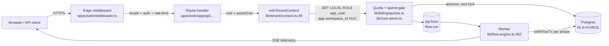
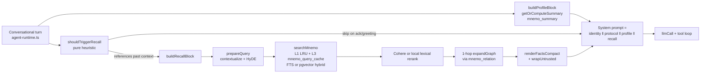
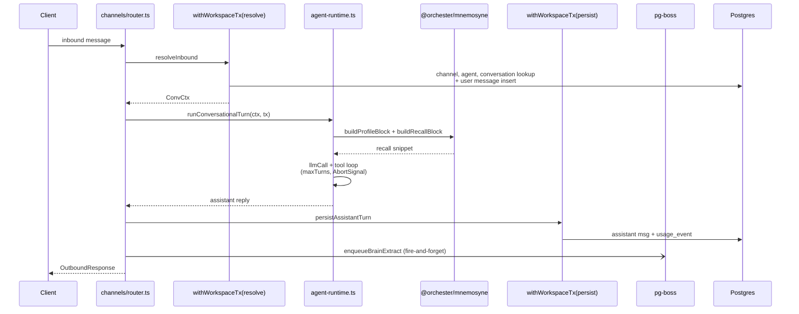
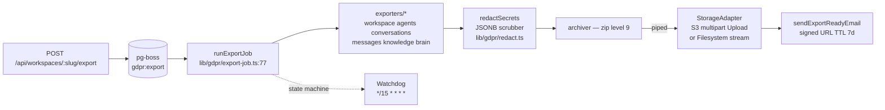

# Architecture

This document is the map of the codebase. It explains what lives where, how a request flows through the system, where the security boundaries are, and which decisions are load-bearing.

Audience: new contributors and anyone evaluating Orchester for a non-trivial deployment. Out of scope: tutorials and "how to use Orchester" — see the [README quickstart](../README.md#quickstart) for that.

## Top-level shape

```
orchester/
├── apps/
│   ├── web/         Next.js 15 application (Studio UI + REST API + MCP + worker)
│   └── widget/      Embeddable chat widget (separate bundle)
├── packages/
│   ├── db/          Drizzle schema, migrations, typed client
│   └── mnemosyne/   Multi-tenant memory engine (extraction, recall, consolidation)
├── scripts/
│   └── audit-invariants.sh   Structural CI guard
└── docs/            Public docs: this file, ADRs, runbook, audit playbook
```

One Next.js app. Two packages — the typed DB layer and the memory engine. One widget. The worker process lives inside the web app and shares the same code paths — see "Worker" below. `@orchester/mnemosyne` is intentionally Next-agnostic (no `server-only`, no `@/` aliases) so it remains OSS-extractable.

## Runtime topology

```
                        ┌──────────────────────────────┐
                        │   Next.js 15 (App Router)    │
                        │                              │
   Browser  ────────►   │   • Studio (React + HeroUI)  │
                        │   • REST API + SSE           │
                        │   • MCP server (HTTP+stdio)  │
   MCP client ──────►   │   • Public /api/v1/*         │
                        └──────────────────────────────┘
                                      │
                                      ▼
            ┌──────────────────────────────────────────────┐
            │   Postgres 15+ with pgvector ≥ 0.7           │
            │   • Application data (Drizzle schema)        │
            │   • Job queue rows (pg-boss)                 │
            │   • Vector embeddings (KB + mnemo_fact)      │
            │   • RLS+FORCE Pattern A on tenant tables     │
            │   • Advisory locks for quota/spend writes    │
            └──────────────────────────────────────────────┘
                                      ▲
                                      │
                        ┌──────────────────────────────┐
                        │   Worker process (pg-boss)   │
                        │   • Flows + reaper           │
                        │   • Mnemosyne crons:         │
                        │     extract, embed, summary, │
                        │     dedup, prune, decay,     │
                        │     consolidate, review      │
                        │   • GDPR export pipeline     │
                        └──────────────────────────────┘
                                      │
                                      ▼
                       ┌────────────────────────────────┐
                       │   AI providers (BYO keys)      │
                       │   80+ adapters, 10 capabilities│
                       └────────────────────────────────┘
```

The worker is the _same_ process bundle as the web app started in a different mode (`pnpm worker:dev` / `pnpm worker`). Schema, types, and helpers are shared at compile time — there is no RPC boundary between the API and worker code.

## Request lifecycle

A representative POST `/api/flows/:id/run` request. The diagram is end-to-end; the steps below annotate each hop with its module.



1. **Edge middleware** (`apps/web/middleware.ts`) — locale routing, auth cookie check, rate limiting (Redis-backed if configured, otherwise an in-memory limiter; both gated by `lib/rate-limit.ts`).
2. **Route handler** (`apps/web/app/api/...`) — zod validates the body, `auth-guards.ts` resolves the session into a `{ userId, workspaceId, role }` triple.
3. **RBAC check** — `lib/rbac.ts` exposes `assertCan(role, action)`. Every mutating route calls it. The structural invariants guard fails the build if a new mutating route forgets either zod or `assertCan`.
4. **Tenant context** — `withTenantContext(workspaceId, fn)` (`lib/tenant/context.ts:49`) opens a Postgres transaction, runs `SET LOCAL ROLE app_user` (drops `BYPASSRLS`), then `SET LOCAL app.workspace_id` + `app.user_id`. Every query inside the callback is subject to RLS+FORCE Pattern A — the WHERE clause is no longer the only thing keeping tenants apart.
5. **Quota + spend gates** — `lib/billing/quotas.ts` (plan limits) and the spend cap check in `lib/cost-alerts.ts` (`assertWithinSpend`) run inside the same DB transaction as the write that consumes them, protected by a `pg_advisory_xact_lock` keyed on `workspaceId`. This closes the TOCTOU window that an earlier audit pass found.
6. **Job enqueue** — for flow runs, the request enqueues a `flow:run` job in pg-boss and returns `202 Accepted` with the `runId`. SSE subscribers stream telemetry as the worker executes.
7. **Worker execution** — `lib/flow-engine.ts:362 executeFlow` walks the flow graph, dispatches to per-node executors (AI calls, HTTP, code-node sandbox, integration adapters, subflows), threads an `AbortSignal` so disconnected clients cancel cleanly, and writes telemetry events as it goes. Each phase opens its own short `withFlowTx` (also `SET LOCAL ROLE app_user` + GUC) so long-running flows don't hold a pool connection.

Read-only requests (list, get) skip steps 5–7 and return inline.

## Data model

`packages/db/src/schema/` is partitioned by domain:

| File              | Owns                                                                                                                                                                |
| ----------------- | ------------------------------------------------------------------------------------------------------------------------------------------------------------------- |
| `core.ts`         | Users, workspaces, memberships, roles, sessions                                                                                                                     |
| `auth.ts`         | Better-Auth tables (accounts, verifications, etc.)                                                                                                                  |
| `workspaces.ts`   | Workspace settings, plans, quotas, audit log                                                                                                                        |
| `ai-providers.ts` | Provider credentials (encrypted), per-workspace model gating                                                                                                        |
| `flows.ts`        | Flows, flow versions, flow runs, run telemetry                                                                                                                      |
| `agent-tools.ts`  | Agent definitions, tool configs, agent memory policy                                                                                                                |
| `integrations.ts` | Integration accounts and credentials                                                                                                                                |
| `knowledge.ts`    | KB sources, chunks, embeddings (pgvector columns)                                                                                                                   |
| `production.ts`   | Webhooks, channels, public API keys                                                                                                                                 |
| `brain.ts`        | Legacy `brain_fact` + `brain_extraction_job` (grace-period readable; new writes go to `mnemo_*`)                                                                    |
| `mnemosyne.ts`    | `mnemo_fact`, `mnemo_decision`, `mnemo_episode`, `mnemo_entity`, `mnemo_relation`, `mnemo_query_cache`, `mnemo_summary`, `mnemo_review_queue`, `mnemo_fact_archive` |
| `gdpr.ts`         | `gdpr_export_jobs` (state machine, signed-URL cache)                                                                                                                |

Migrations live in `packages/db/migrations/` and are produced by `drizzle-kit generate`. Never run `drizzle-kit push` against anything but a throwaway dev DB — the audit playbook documents why. Migrations 0016–0042 grew the memory subsystem; the headline changes:

- `0016_brain_core` — initial fact store (`brain_fact` + extraction jobs).
- `0017_mnemosyne_init` — rename + add `valid_from` / `valid_to` (bitemporal columns) and a stored `text_lemmatized` tsvector for FTS recall.
- `0024_brain_to_mnemo_backfill` — copy live rows; the `brain_*` tables stay readable through the grace period.
- `0026_mnemosyne_bitemporal_gist` — GiST index on `tstzrange(valid_from, valid_to)` so `asOf` time-travel queries are cheap.
- `0034`–`0042` — episode + decision + entity tables, attribution column, agent memory policy, `actor_id`, per-actor RLS policy, protocol-version tagging, and `halfvec(1536)` quantization on `mnemo_fact.embedding` (2× storage cut, <0.5% recall delta).

### Tenancy

Every domain row has a `workspace_id`. The application-layer pattern is unchanged:

```ts
db.query.flows.findMany({ where: eq(flows.workspaceId, workspaceId) });
```

The structural-invariants guard still enforces that every workspace-scoped query carries the `workspaceId` predicate. **But** as of migrations 0008–0013 and the 2026-05-24 audit P0 fix, every tenant-scoped table now also has RLS+FORCE Pattern A policies that consult `current_setting('app.workspace_id')`. The two layers compose:

- Application filter — first line, catches dev mistakes at code-review time.
- RLS+FORCE — defence in depth, catches anything the filter missed at the DB layer.

The audit found that the deployed `DATABASE_URL` connects as a role with `rolbypassrls=t`, which silently disables RLS. The fix in `lib/tenant/context.ts` and `packages/mnemosyne/src/tx.ts` is to `SET LOCAL ROLE app_user` at the top of every tx — `app_user` is `NOINHERIT` with no `BYPASSRLS`, so RLS+FORCE actually applies regardless of how the connection was authenticated. The transaction-local scope means the role auto-reverts on commit/rollback and never leaks across pooled connections. See ADR-0010 for the layered remediation.

Three transaction wrappers, all built on the same pattern:

| Wrapper                       | Authn check               | GUCs set                                                                      | Use case                                                |
| ----------------------------- | ------------------------- | ----------------------------------------------------------------------------- | ------------------------------------------------------- |
| `withTenantContext`           | session + membership      | `app.workspace_id`, `app.user_id`                                             | User-facing API routes                                  |
| `withWorkspaceTx`             | none (caller responsible) | `app.workspace_id`                                                            | Webhooks, MCP, worker, flow engine                      |
| `withMnemoTx` (mnemosyne pkg) | none                      | `app.workspace_id`, optionally `app.actor_id` + `app.enforce_actor_isolation` | Memory reads/writes; per-actor isolation is opt-in v1.6 |

`withMnemoTx` exposes both a legacy `(workspaceId, fn)` form and a v1.6 options form `({ workspaceId, actorId, enforceActorIsolation }, fn)`. When the actor GUCs are set, the RESTRICTIVE policy from migration `0040_mnemosyne_actor_isolation_policy` narrows visible `mnemo_fact` rows to `actor_id IS NULL OR actor_id = $actorId` — so a multi-tenant agent runtime that serves Alice and Bob on the same pooled connection never leaks Bob's private facts into Alice's recall.

## Mnemosyne (memory engine)

Mnemosyne is the v1.6 GA memory layer. It exposes four cognitive primitives and a recall pipeline the agent runtime injects into every conversational turn.

| Primitive    | Table            | Module                                          | What it is                                                                              |
| ------------ | ---------------- | ----------------------------------------------- | --------------------------------------------------------------------------------------- |
| **Fact**     | `mnemo_fact`     | `packages/mnemosyne/src/primitives/fact.ts`     | Durable factual knowledge with hybrid recall (semantic + recency + decay + pin)         |
| **Decision** | `mnemo_decision` | `packages/mnemosyne/src/primitives/decision.ts` | Recorded choice + rationale + supersedes link, queryable as facts                       |
| **Episode**  | `mnemo_episode`  | `packages/mnemosyne/src/episode/`               | Timeline event with duration and linked facts; meeting/milestone-shaped data lives here |
| **Entity**   | `mnemo_entity`   | `packages/mnemosyne/src/entity/`                | Canonical person / org / project / concept / place; facts reference it via `entity_id`  |

Every primitive ships with `memory_type` (semantic / episodic / procedural / working), `attribution` (user_stated / user_belief / objective_fact / inferred — theory-of-mind discriminator), and `protocol_version` (the Memory Protocol revision the row was extracted under). Facts also carry bitemporal `valid_from` / `valid_to` so historical state is queryable via `searchMnemo({ asOf })`.

### Extraction pipeline

After every conversational turn, the channels router (`apps/web/lib/channels/router.ts:580 handleInbound`) fires `enqueueBrainExtract` as fire-and-forget — the agent reply has already shipped to the user. A `brain:extract` pg-boss job (the name is preserved from the v0.1 Brain Core era — the handler now writes to `mnemo_*` tables) carries the work:

```mermaid
flowchart LR
  Turn[Inbound user turn<br/>handleInbound]
  Q[(pg-boss<br/>brain:extract)]
  Job[runBrainExtractJob<br/>lib/brain/extract-job.ts:79]
  Pre[shouldExtract<br/>prefilter — pure heuristic]
  LLM[extractFacts<br/>lib/brain/extract.ts:126]
  Ent[extractEntities<br/>mnemosyne/entity]
  Save[saveFactWithCandidates<br/>+ findOrCreate entity]
  Epi[extractEpisode<br/>if ≥ 2 facts]
  DB[(mnemo_fact<br/>mnemo_entity<br/>mnemo_episode)]

  Turn -->|singletonKey per convId| Q
  Q --> Job
  Job --> Pre
  Pre -->|signal-bearing| LLM
  Pre -->|greeting / ack| Job
  LLM --> Ent
  Ent --> Save
  Save --> DB
  Save --> Epi
  Epi --> DB
```



Notable invariants:

- The `shouldExtract` prefilter (`packages/mnemosyne/src/extraction/prefilter.ts:104`) is pure code and skips ~80% of turns (greetings, acks, smalltalk) before any LLM is touched — the dominant per-turn extraction-cost win.
- The job runs inside `withCrossTenantAdmin` so the cross-workspace message read is satisfied, then opens `withMnemoTx(workspaceId, …)` for every `saveFactWithCandidates` call. Each fact's `actor_id` is set from `conversation.employeeId`; workspace-shared facts pass `null`.
- The extraction model is the workspace's configured cheap tier via `resolveSmallTierModel` (`lib/brain/model-resolve.ts`). Hardcoded provider strings are forbidden by Mnemosyne Charter §25 and enforced by the audit invariants.
- Provider health is sampled per call via `recordProviderResult`; when the rolling window trips the circuit breaker, the job is **deferred** (`state='deferred_provider_outage'`) and re-enqueued with `startAfter` so the conversation isn't lost during an outage.
- The `memory_learning_paused` flag on `conversation` is the forward gate for sensitivity — when true, the job short-circuits to `state='skipped_sensitivity'` with no LLM call.

### Recall pipeline (injection into the agent system prompt)

`apps/web/lib/agent-runtime.ts` is the only entry point that runs an agent for a chat turn. The system prompt it builds for every conversational turn is the concatenation of a **cached prefix** (identity + Memory Protocol + distilled user-profile summary) and a **dynamic suffix** (the live recall block). The Anthropic prompt-cache boundary is set at the exact character offset where the cached prefix ends, so the static portion is billed at ~10% on cache hits.



The pipeline reads top-to-bottom (`apps/web/lib/agent-runtime.ts:295 buildRecallBlock`):

1. **`shouldTriggerRecall`** (heuristic, no IO) — skips on greetings/acks; runs on anything that looks like it references past context. Saves ~50% of recall calls on noisy workspaces.
2. **Policy + settings** load in parallel (`getAgentMemoryPolicy`, `getMnemoSettings`). Both return safe defaults on failure — recall is optimisation, never a hard dependency.
3. **Query preparation** — when history ≥ 2 turns, `prepareQuery` contextualizes the user turn (resolves "it"/"the same thing") and produces a HyDE (Hypothetical Document Embedding) rewrite. Both transforms are LLM-backed and opt-in; v1.6 flips them ON by default with a per-workspace `mnemo.disable_hyde` kill switch.
4. **Hybrid retrieval (`searchMnemo`)** runs over three cache layers:
   - **L1** — in-process workspace LRU (60 s TTL, ~5K entries, keyed on `(workspaceId, queryHash, scope, scopeRef, topK, agentId)`).
   - **L2** — embedding LRU lives inside `embedMnemo`, workspace-keyed.
   - **L3** — `mnemo_query_cache` table — cross-pod semantic cache. A query whose embedding has cosine ≥ 0.95 against a row created in the last 5 min short-circuits the full pipeline. Skipped when `asOf` is set (time travel must hit the live SQL).
   - Mode A (no embedding provider) falls back to `text_lemmatized` GIN FTS; Mode B/C uses pgvector cosine (`halfvec` since migration 0042) plus the blended hybrid score.
5. **Cross-encoder rerank** — Cohere when `COHERE_API_KEY` is set, otherwise the BM25-ish local lexical reranker (`makeLocalLexicalRerank`). Identity rerank is a regression — there is always _some_ rerank signal in v1.6.
6. **Post-recall pruning** — drop facts with cosine > 0.88 against an already-kept fact (kills near-duplicates), then hard-cap to `maxResults` (default 3 in v1.6, down from 5 — prompt-injection studies showed 3 focused facts beat 5 noisy ones).
7. **1-hop graph expansion** — when `expandGraph` is on, walk `mnemo_relation` edges (`derived_from`, `supersedes`, `part_of`, `member_of`, `scoped`, `related`) from the top hits and let a strong neighbor crowd out a weaker direct hit before the final cap.
8. **Render** — memory hits via `renderFactsCompact` inside `<recalled-memory>`, KB hits as one `<kb source="…">` element per hit. Both are wrapped in `<untrusted_context>` and the system prompt carries `UNTRUSTED_CONTENT_GUARDRAIL` so prompt-injection payloads embedded in the retrieved data are treated as data, not instructions.

Each stage is wrapped in `try / catch` — a flaky reranker, KB provider, or policy load never breaks the turn; recall degrades to whatever's available.

### Consolidation crons

The worker process schedules the maintenance crons that keep the fact store healthy. All of them open `withMnemoTx(workspaceId, …)` and are budget-gated against the workspace AI spend cap.

| Job (`apps/web/lib/queue.ts`) | Schedule      | Handler                       | Purpose                                                                                  |
| ----------------------------- | ------------- | ----------------------------- | ---------------------------------------------------------------------------------------- |
| `JOB_MNEMO_EMBED_BATCH`       | `*/1 * * * *` | `worker/embed-batch-job.ts`   | Fill `embedding = NULL` rows in batched API calls (`createFactAsync` defers cost)        |
| `JOB_MNEMO_SUMMARY`           | `0 5 * * *`   | `worker/summary-job.ts`       | Distill user-profile summary into `mnemo_summary` for the cached system-prompt prefix    |
| `JOB_MNEMO_HEALTH`            | `0 6 * * *`   | `worker/health-job.ts`        | Per-workspace memory-drift snapshot (recall hit rate, embedding coverage, backlog)       |
| `JOB_MNEMO_DEDUP`             | `0 3 * * 0`   | `worker/dedup-job.ts`         | Semantic dedup; archive losers into `mnemo_fact_archive`                                 |
| `JOB_MNEMO_PRUNE`             | `30 3 * * 0`  | `worker/prune-job.ts`         | Drop inactive facts past the grace window                                                |
| `JOB_MNEMO_REVIEW_SWEEP`      | `0 4 * * *`   | `worker/review-sweep-job.ts`  | Queue low-confidence facts for human triage in `mnemo_review_queue`                      |
| `JOB_MNEMO_AUTO_PIN`          | `30 4 * * *`  | `worker/auto-pin-job.ts`      | Apply pure auto-pin rules (`decideAutoPin`) to high-recall facts                         |
| `JOB_MNEMO_CONSOLIDATION`     | `0 2 * * 0`   | `worker/consolidation-job.ts` | REM-style: cluster related facts, ask the cheap LLM for a one-sentence supersede summary |
| `JOB_BRAIN_DECAY`             | `0 4 * * *`   | `lib/brain/decay.ts`          | Exponential decay of `relevance` (true half-life, H=30 d, pinned facts exempt)           |

Consolidation runs BEFORE the dedup sweep on Sunday so the janitor sees a stable graph (the new summary has diverged enough from its members not to be collapsed back).

## AI catalog

`lib/ai/` is the adapter layer. Three concentric concepts:

- **Capabilities** — chat, image, video, embeddings, rerank, TTS, STT, code, vision, OCR. Defined as TypeScript discriminated unions; every adapter implements one or more.
- **Providers** — the vendors (OpenAI, Anthropic, Google, etc.). Each provider has a record in the catalog with metadata: which capabilities it implements, model list, pricing, auth shape.
- **Adapters** — concrete `runChat(...)`, `generateImage(...)`, etc. functions per provider, normalized to a common request/response contract.

Adding a new provider that fits an existing family (e.g. another OpenAI-compatible endpoint) is a single row in the catalog. A genuinely new family is a new adapter file plus a catalog entry.

Costs are computed from token usage × catalog price and written to `usage_events` synchronously inside the adapter. That row is what the spend cap reads. Every Mnemosyne dispatch (extraction, entity classification, episode synthesis, summary distillation, consolidation) goes through the same metering — the audit invariants enforce `assertWithinSpend` + `recordAiUsage` adjacent to every `llmCall(`.

## Conversational turn (channels)

`lib/channels/router.ts handleInbound` and `handleInboundStream` are the entry points for inbound messages from Slack, Telegram, the embeddable widget, and the public REST API. The flow is the same for both — streaming only changes where the txn boundaries fall.



Two short transactions instead of one long one: the LLM tool-use loop runs outside of any open txn so a slow upstream provider doesn't hold a pool connection. The streaming variant goes one step further — `llmStream` yields between `resolveInbound` and `persistAssistantTurn` so each phase owns its own tx (drizzle / postgres-js does not support transactions that cross async generator yields).

Take-over, plan quota, employee budget, flow-driven agents (`agent.kind === "flow"`), and human handoff are all resolved as **terminal** outcomes inside `resolveInbound` — the LLM loop only runs for the genuine conversational path.

## Flow engine

`lib/flow-engine.ts:362 executeFlow` is the heart of the runtime. Responsibilities:

- Topologically iterate the flow graph (DAG with conditional edges).
- Dispatch per-node execution to handlers registered in `lib/flows/node-registry.ts`.
- Manage parallel branches with bounded fan-out (per-flow concurrency cap, enforced via a Postgres advisory lock keyed on `(workspaceId, flowId)`).
- Thread `AbortSignal` through every async dispatch so client disconnect propagates to in-flight AI calls.
- Emit telemetry events (`node_started`, `node_succeeded`, `node_failed`, `flow_completed`) for the SSE stream and run inspector.
- Open a short `withFlowTx` per phase — never one tx for the whole run. The wrapper mirrors `withTenantContext`'s `SET LOCAL ROLE app_user` + GUC dance so FORCE RLS applies on every read/write.

Nodes are pure-ish — they read from the run context and return `{ outputs, telemetry }`. Side effects (HTTP, AI calls, DB writes) go through narrow modules that the engine doesn't otherwise know about.

The code-node is a special case: it runs in `node:vm` with timeouts, restricted globals, and a per-workspace feature gate. The audit playbook explicitly notes `node:vm` is not a security boundary — it's a usability boundary. RCE-equivalent capability stays gated behind explicit opt-in.

## Worker

The worker process consumes the pg-boss queue. Beyond the Mnemosyne crons listed above:

- `flow:run` — the main flow execution path.
- `flow:reap` — periodic scan for runs stuck in `running` past their deadline; transitions them to `failed` with a documented reason. Idempotent.
- `gdpr:export` — see the GDPR section below.
- `gdpr:export:watchdog` — every 15 minutes, flips orphaned `exporting` rows back to `failed` so the UI doesn't spin forever after a worker SIGKILL.
- `data:retention` — daily purge of expired transient data.
- `audit:verify_all_chains` — daily verification of the append-only audit-log Merkle chain.
- `workspace:hard_delete` — completes pending workspace deletions past the grace window.
- `webhook:deliver` — outbound webhook dispatch with exponential backoff.
- `usage:aggregate` — daily rollup of `usage_events` into `usage_daily` for billing UI.

The worker shares code with the web app, so adding a new job type means: new handler module, register it in `lib/queue.ts`, deploy. No separate build pipeline.

## GDPR export pipeline

Phase F.5 (post-2026-05-26) replaced the in-memory `Buffer.concat` archive builder with a true streaming pipeline. `archiver` writes straight into the storage adapter — peak worker memory is bounded by archiver's deflate buffer plus a single multipart part (5–10 MB on S3) instead of the full archive, so multi-GB tenant exports no longer SIGKILL the worker.



The pipeline runs inside `withCrossTenantAdmin` (the request is admin-initiated against a single workspace, but the read crosses workspace-scoped tables that need the cron bypass). Each per-table exporter cherry-picks columns to drop known-sensitive ones (`credentialsEncrypted`, `secret`, `restoreToken`, `embedding`), and **every JSONB column** is then walked by `redactSecrets` (`lib/gdpr/redact.ts`) — a defensive scrubber that replaces well-known provider keys (`sk-…`, `sk-ant-…`, `AIza…`, Stripe / Resend / Slack / GitHub / Notion / Orchester own prefixes), JWT-shaped strings, and the value of any object key named `apikey`, `secret`, `token`, etc. with the literal `<REDACTED>`. False positives are fine for an export; false negatives are not.

The `MAX_ARCHIVE_BYTES` (1 GiB) guard counts bytes on archiver's `data` event; tripping aborts the source stream, which the S3 adapter translates into `AbortMultipartUpload` and the filesystem adapter into `unlink` — no orphan partial uploads.

Signed-URL generation never persists the URL plain: the polling route re-derives a fresh signed URL per request via `regenerateSignedUrl`, so a leaked job row gives an attacker a storage key, not a working download link.

## Authentication & authorization

- **Authentication** — [Better Auth](https://www.better-auth.com/) with email/password and (optionally) OAuth providers. Sessions are cookie-based, HttpOnly + SameSite=Lax + Secure in production.
- **Authorization** — `lib/rbac.ts` defines four roles (`owner`, `admin`, `editor`, `viewer`) and a closed enum of `Action`s. `can(role, action)` is the only sanctioned check; routes call `assertCan` which throws `ForbiddenError` and gets translated to `403` by the API response helper.
- **API keys** — `/api/v1/*` accepts a per-workspace API key (`x-api-key` header). Keys are hashed (Argon2id) at rest and scoped to a workspace + role.
- **MCP** — same auth as `/api/v1/*` for HTTP transport; stdio uses a token injected via env at process spawn.

## Encryption

`lib/encryption.ts` implements AES-256-GCM with versioned keys:

- Encryption key set is loaded from `ENCRYPTION_SECRET` (current) and `ENCRYPTION_SECRET_V1..N` (older versions, for decrypt-only).
- Every ciphertext carries the key version it was encrypted under. Rotation is: add a new version to env, redeploy, run the re-encryption job. No downtime.
- Provider credentials and integration tokens go through this layer. Sessions and ephemerals do not.

## Observability

- **Logs** — structured JSON via a thin wrapper around `pino`. Every log line carries `runId`, `workspaceId`, `userId` when in scope.
- **Telemetry events** — flow runs emit a stream of structured events the studio's run inspector consumes via SSE.
- **Metrics** — no external metrics backend by default. Hooks exist in `lib/observability.ts` for plugging in OTLP/Prometheus exporters; self-hosters wire these up to their existing stack.
- **Audit log** — `lib/audit/log.ts` writes one row per sensitive mutation (member added, role changed, key created, provider credential rotated, brain.fact.extracted). The log is an append-only Merkle chain; `audit:verify_all_chains` runs daily.
- **Memory drift** — `mnemo_health` snapshots fact counts, recall hit rate, contradiction surface, extraction backlog, and embedding coverage per workspace per day. Surfaced via `GET /api/mnemo/health` and the Inspector UI.

## Cost & quota enforcement

Two independent gates:

1. **Plan quotas** — `lib/billing/quotas.ts` reads `workspace.plan` and compares against `workspace.usageThisPeriod`. Rejects with `402` when over.
2. **Spend cap** — `lib/cost-alerts.ts` `assertWithinSpend` reads `workspace.aiMonthlyCapUsd` and the `usage_events` sum for the period. Rejects with `402` when over.

Both run inside the same transaction as the write they gate, under an advisory lock. There is also a global kill-switch (`AI_DISABLED=1`) that short-circuits every AI call without touching the DB. Background AI dispatches (extraction, entity classification, episode synthesis, consolidation, summary distillation) all gate against the same spend cap before issuing the call.

## Security posture

The summary version. Detailed threat model and remediation history live in [`AUDIT_PLAYBOOK.md`](AUDIT_PLAYBOOK.md).

- **Multi-tenancy** — every workspace-scoped query carries `workspaceId`. Enforced structurally by the invariants guard and at the DB layer by RLS+FORCE Pattern A. The deployed `app_user` role lacks `BYPASSRLS`; `withTenantContext` / `withWorkspaceTx` / `withMnemoTx` `SET LOCAL ROLE app_user` to defend against connecting as an elevated role.
- **Per-actor isolation** — `withMnemoTx` v1.6 options set `app.actor_id` + `app.enforce_actor_isolation`; the RESTRICTIVE policy from migration 0040 narrows visible `mnemo_fact` rows so a multi-tenant agent on one DB connection cannot read another end-user's private facts.
- **Prompt injection** — retrieved memory + KB content is wrapped in `<untrusted_context>` and the system prompt carries `UNTRUSTED_CONTENT_GUARDRAIL` instructing the model to treat it as data. `wrapUntrusted` sanitises the `source` attribute so the markup itself can't be broken out of.
- **Code execution** — code-node uses `node:vm`. Per-workspace gate, hard timeout, restricted globals. Not claimed as a sandbox against a determined attacker.
- **Outbound network** — `lib/net-guard.ts` validates URLs before HTTP-node dispatch (no private IP ranges, no localhost, no metadata endpoints) to mitigate SSRF.
- **Secrets at rest** — all third-party credentials encrypted (above). `.env` files are gitignored; example file ships with placeholder values only. `gitleaks` runs in CI.
- **GDPR export scrubbing** — `redactSecrets` walks every JSONB column on the way out, replacing well-known provider key shapes with `<REDACTED>` even when the exporter forgot to drop a column.
- **Dependency hygiene** — Dependabot with grouped patches; `pnpm audit` runs in CI.
- **Supply chain** — DCO sign-off required on all PRs.

## Deployment topology

Two reference deployments:

### Single-node (self-hoster default)

```
Docker host
├── orchester-web      Next.js app
├── orchester-worker   Same image, started as worker
├── postgres-pgvector  Postgres 15 + pgvector ≥ 0.7
└── (optional) redis   Rate limiting at scale
```

Single Postgres database. Single worker process. Suits up to a few thousand active users. The GDPR storage backend defaults to `STORAGE_BACKEND=filesystem` writing to `GDPR_EXPORT_DIR` (signed URLs are HMAC-envelope tokens served by `/api/exports/[token]`).

### Managed Postgres + serverless web

```
Vercel (or any Node host)
├── Next.js app        Edge for static, Node for API
└── Worker             Separate long-running process (Fly, Render, Railway, K8s)

Managed Postgres (Supabase, Neon, RDS, Aiven, CrunchyData)
└── pgvector ≥ 0.7 enabled

S3-compatible object storage for GDPR archives
└── STORAGE_BACKEND=s3
```

The worker MUST be a long-running process — it polls. Serverless functions don't work as the worker host. The web app itself is happy on serverless.

## Code conventions

- Strict TypeScript. `any` is rejected in PR review.
- No default exports for cross-module functions.
- Server-only modules import `"server-only"` so a mis-import surfaces at build time. `@orchester/mnemosyne` is the exception: it stays package-clean (no `server-only`, no `@/` aliases) so the host app guards server-only execution at its own boundary.
- Public API responses go through `lib/api-response.ts` — direct `Response.json(...)` in routes is rejected by review.
- Per-module tests colocated as `*.test.ts`.

## Testing

- **Unit + integration** — Vitest. Run `pnpm --filter @orchester/web test`. 80+ specs cover the flow engine, RBAC, providers, copilot tools, spreadsheet, encryption, plus the full Mnemosyne suite in `packages/mnemosyne/tests/`.
- **Structural invariants** — `scripts/audit-invariants.sh` (also runs in CI). Checks:
  - Every mutating route has zod validation.
  - Every mutating route has an `assertCan` call.
  - Every AI dispatch writes a `usage_events` row.
  - Every file naming `llmCall(` has adjacent `assertWithinSpend` + `recordAiUsage` calls.
  - Every flow execution carries an `AbortSignal`.
- **Type checking** — `pnpm --filter @orchester/web exec tsc --noEmit`. Zero-error policy on `main`.

## Where to read next

- [`docs/migrations.md`](migrations.md) — how schema changes get authored, reviewed, and shipped.
- [`docs/encryption-key-rotation.md`](encryption-key-rotation.md) — rotating `ENCRYPTION_SECRET` without downtime.
- [`docs/dependency-licenses.md`](dependency-licenses.md) — license inventory for the dependency tree.
- [`docs/UI-DESIGN-SYSTEM.md`](UI-DESIGN-SYSTEM.md) — studio UI tokens and components.
- [`docs/adr/`](adr/) — architecture decision records (ADR-0010 covers the `app_user` role-downgrade).
- [`docs/specs/2026-05-24-mnemosyne-design.md`](specs/2026-05-24-mnemosyne-design.md) — Mnemosyne design spec, source of truth for the memory subsystem.
